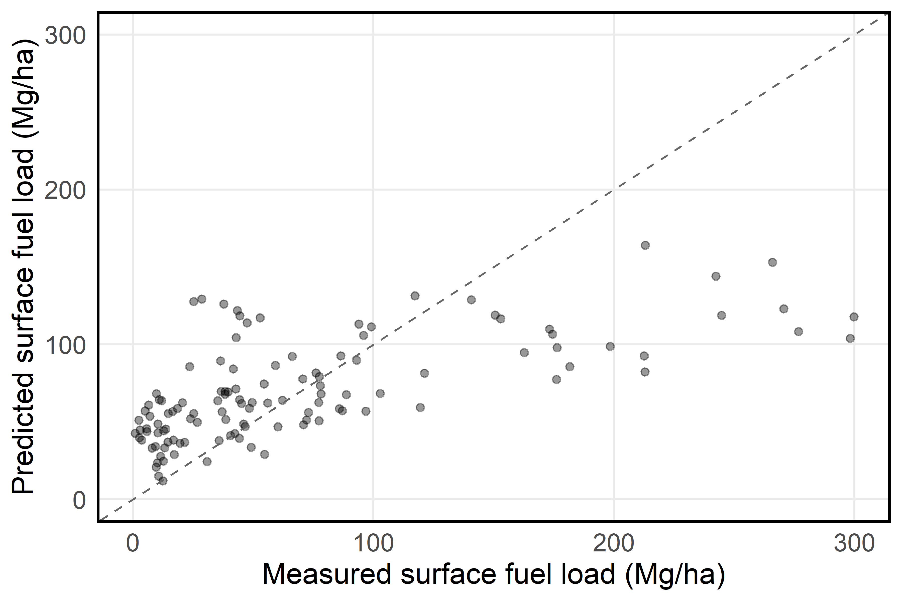
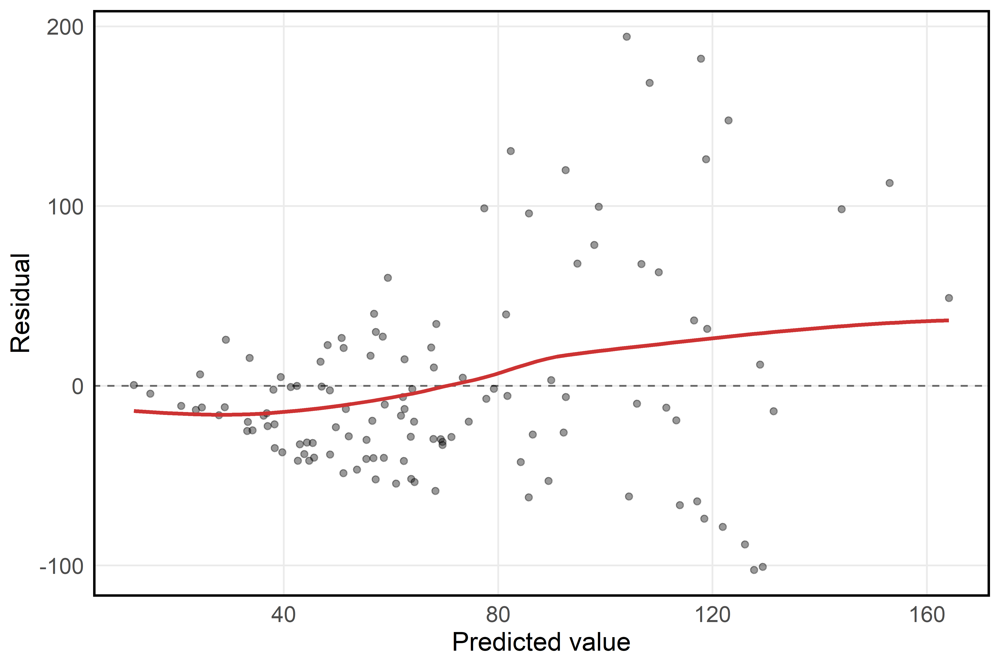
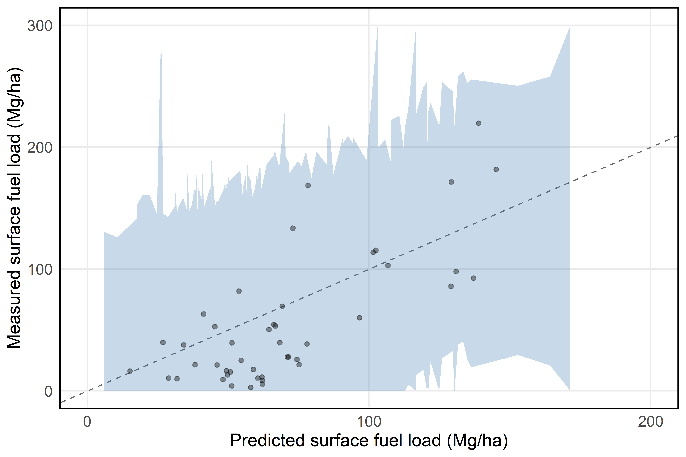
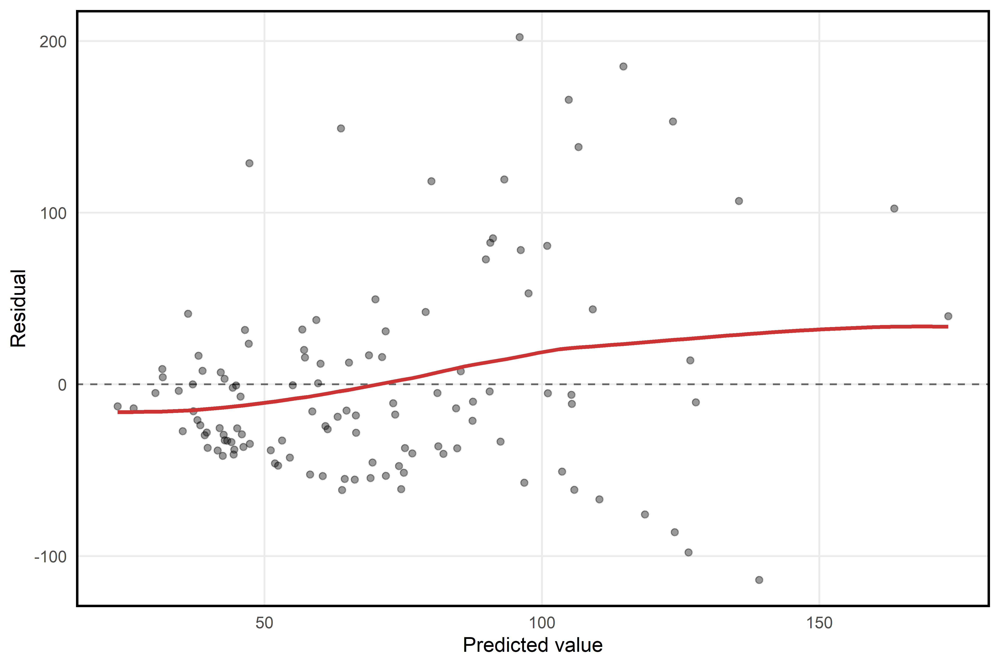
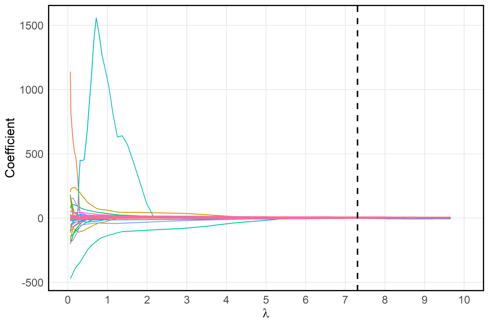
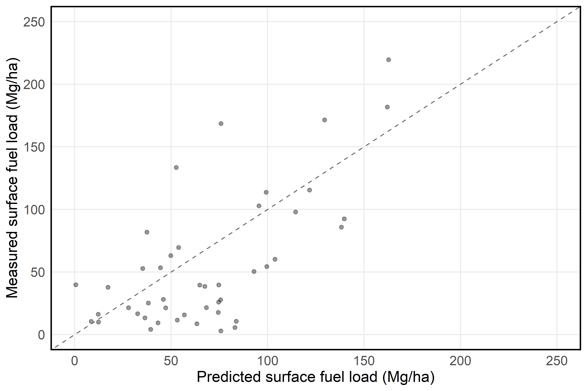

## Introduction 

Surface fuels (dead woody material on the forest floor, including fallen twigs, branches, and logs) are a critical forest feature to measure and monitor because they are a primary driver of wildfire behavior. Forest managers use estimates of surface fuels load (weight of surface fuels per unit area) to model potential wildfire behavior, estimate smoke production from prescribed burns, and plan fuel reduction treatments to mitigate wildfire risk. Surface fuels are highly variable across time and space and, therefore, must be measured frequently at a high sampling intensity. However, doing so is extremely labor-intensive using current standard field-based methods.

A promising alternative is to predict surface fuel load using terrestrial LiDAR scans. Terrestrial LiDAR is a ground-based remote sensing technology that generates detailed 3D point clouds (see Appendix for figures of the 3D point clouds). A single scan takes only about five minutes in the field, making it substantially faster than traditional methods. Our goal for this project is to develop a predictive model for surface fuel load using metrics derived from terrestrial LiDAR scans. 

## Data description 

A total of 164 plots were measured across six sites in the Sierra Nevada mixed-conifer forest zone (Table 1). The plots from site BGL were measured and provided by Kea Rutherford, while the data from the remaining sites were provided by collaborators at UC San Diego. 

\begin{table}[h!]
\centering
\begin{tabular}{lc}
\hline
Site & Number of Plots \\
\hline
BGL & 25 \\
DLB & 26 \\
IND & 21 \\
SHA & 25 \\
TCU & 42 \\
WIN & 25 \\
all sites & 164 \\
\hline
\end{tabular}
\caption{Number of observations across sites.}
\end{table}

At each plot, a terrestrial LiDAR scan was taken at plot center. All scans were uploaded to and processed by IntELiMon (Interagency Ecosystem LiDAR Monitoring program maintained by the US Geological Survey's Earth Resources Observation and Science Center). The output from IntELiMon is a large set of plot-level summary metrics derived from the LiDAR scans. Example metrics include: (1) fine_l1_cnt (count of points in the 0-3 meter high voxelized point clouds with tree stems and shrubs removed), (2) TBA (total basal area of all detected overstory trees calculated from classified stem points in the point cloud), and (3) shrubs_l1_cnt (count of points in the Shrub classified voxelized point cloud). Surface fuels were also directly measured at each plot using line-intercept transects (the current standard field-based method; Brown 1974). 

For this project, the response variable was total surface fuel load in megagrams per hectare (Mg/ha) calculated from the line-intercept transect data. The response variable is continuous, ranging from 0.89 to 299.85 Mg/ha. The predictor variables consisted of site (a factor variable with six levels) and 74 summary metrics derived by IntELiMON from the terrestrial LiDAR scans (all of which are numeric). 

## Final regression model 

Our final model was a ridge regression. Because this was a predictive problem in which all the predictors are readily available to managers using terrestrial LiDAR scans processed by IntELiMon, a sparse solution was not required; thus, ridge regression was an appropriate choice. 

Although ridge regression does not rely on the Gauss-Markov or Normal Linear Model assumptions, the baseline assumption of linearity must still be met. We assessed this by visually inspecting the residual plot for curvilinear trends and found no evidence of concerning model misspecification (Fig. 2 in additional work section). 

Prior to model fitting, the data were split into training (75%) and testing (25%) sets, with proportional representation of all six forest sites in both sets. The tuning parameter $\lambda$ was selected based on the value that minimized the mean squared error using 10-fold cross-validation on the training set. The ridge model was ultimately selected because it achieved the best predictive performance, as measured by root mean squared error (RMSE) and $R^2$, on the held-out testing set.

For the final model, RMSE was 38.7 Mg/ha and $R^2$ was 0.46, indicating a moderate level of predictive performance. The fitted line plot (also based on the held-out testing set) reflects this overall agreement, but also shows a tendency to overpredict smaller values (Fig. 1).

```{r fig:myimage1, echo=FALSE, fig.cap="Ridge regression fitted line plot for testing set.", out.width="80%", fig.align="center", fig.pos='H'}

```

\newpage

## Discussion

Forest managers most commonly use estimates of surface fuel load to (1) model potential wildfire behavior and (2) estimate smoke production (and carbon loss) from prescribed burns. These two applications require different levels of accuracy in surface fuel load estimation. 

Fire behavior models typically rely on a standardized set of 53 discrete surface fuel models (Scott and Burgan 2005). Each model represents a pre-parameterized combination of fuel bed characteristics that influence fire behavior, including fuel load, surface-area-to-volume ratio, packing ratio, and extinction moisture content. Because it is operationally impractical to measure all of these characteristics in the field, managers generally use broad fuel type (e.g., timber litter or slash) along with surface fuel load to select the most appropriate fuel model. As a result, surface fuel load estimates do not need to be highly accurate to be useful in this context—the primary goal is to assign a plot to a reasonable discrete fuel model. From this perspective, our predictive model may be sufficiently accurate to guide managers toward an appropriate fuel model.

In contrast, smoke production models use surface fuel load as a direct quantitative input. Consequently, these models require more accurate estimates of fuel load. In this context, the predictive performance of our model is likely insufficient to support reliable smoke production estimates.

The model exhibits some bias, tending to overpredict low fuel loads. This is less concerning than underpredicting high surface fuel loads, which could lead to underestimation of wildfire risk and insufficient management response. 

Predictive performance may be improved by incorporating LiDAR-derived metrics that more directly capture forest floor structure. For example, surface rugosity (i.e., surface roughness) has been proposed as a potentially informative predictor of surface fuel characteristics. Enhancing the set of metrics produced by IntELiMon to better represent forest floor complexity could improve model performance.

A key limitation of this project is the relatively small and geographically limited dataset (164 plots across six sites). The model would likely not generalize well beyond these specific sites. To support broader application across California, it would be necessary to develop models for all major ecological subregions of the Sierra Nevada.

## Conclusion 

Forest managers are responding to the ongoing wildfire crisis across western North America by assessing wildfire risk and implementing fuel reduction treatments at increasingly large scales. Consequently, the ability to efficiently estimate surface fuel loads across large spatial scales is becoming increasingly important. Our results demonstrate the potential of predicting surface fuel load using metrics derived from terrestrial LiDAR scans via the IntELiMon workflow, particularly in the context of fire behavior modeling, where the primary objective is to assign a reasonable discrete fuel model. This project provides an initial proof of concept that could potentially be improved by incorporating LiDAR-derived metrics more specifically targeted at forest floor structure (e.g., surface rugosity) and by expanding the dataset to include all major ecological subregions of the Sierra Nevada.

\newpage

## Additional work 

### Additional work and diagnostics for ridge regression 

```{r fig:myimage2, echo=FALSE, fig.cap="Ridge regression residual plot.", out.width="80%", fig.align="center", fig.pos='H'}

```

\newpage

For our final model (ridge regression), we constructed 90% conformal prediction intervals to quantify predictive uncertainty. Conformal prediction is appropriate in this setting because it is distribution-free and does not rely on assumptions such as homoskedasticity, instead requiring only that the data are exchangeable. We constructed the intervals using the training set and then displayed them on the fitted-line plot for the held-out testing set (Fig. 3). We would expect approximately 90% of the test data points to fall within the prediction interval; in this test set, 100% of the data points fell within the interval. In this particular application, the prediction intervals were very wide, limiting their usefulness for informing surface fuel load predictions in practice. 

```{r fig:myimage3, echo=FALSE, fig.cap="Fitted line plot for testing set with conformal prediction intervals generated from training set.", out.width="80%", fig.align="center", fig.pos='H'}

```

\newpage

### LASSO regression 

We fit both ridge and LASSO (Least Absolute Shrinkage and Selection Operator) regression models. LASSO is a reasonable alternative in this setting because it performs variable selection by shrinking some coefficients exactly to zero, which can be useful when many predictors may be irrelevant, as was likely the case here. Specifically, we fit a group LASSO, which selects or removes entire groups of variables rather than individual predictors. This ensured that site, a six-level factor variable represented via five dummy variables, was selected or removed as a group. None of the numeric LiDAR variables were explicitly grouped together. 

As with the ridge regression, we assessed the adequacy of the linear model by visually inspecting the residual plot for curvilinear trends. Once again, we did not find concerning evidence of model misspecification (Fig. 4).

```{r fig:myimage4, echo=FALSE, fig.cap="LASSO regression residual plot.", out.width="70%", fig.align="center", fig.pos='H'}

```

\newpage

The LASSO model selected 11 variables (i.e., non-zero coefficients; Fig. 5), including site, the count of points in the 0-3 m high voxelized point clouds with tree stems and shrubs removed, five summary metrics on the entire voxelized point cloud, and four summary metrics on points classified as shrubs. 

```{r fig:myimage5, echo=FALSE, fig.cap="LASSO coefficient path plot. Dashed line indicates selected lambda value.", out.width="70%", fig.align="center", fig.pos='H'}

```

In terms of predictive performance, the LASSO model performed slightly worse than the ridge model, with a higher RMSE (39.4 vs. 38.7 Mg/ha) and a lower $R^2$ (0.44 vs. 0.46) on the held-out testing set. The fitted line plot reflects this moderate predictive performance (Fig. 6). These results suggest that, while LASSO provides a more interpretable, sparse model, the ridge regression offers better overall predictive accuracy for this application.

```{r fig:myimage6, echo=FALSE, fig.cap="LASSO regression fitted line plot for testing set.", out.width="70%", fig.align="center", fig.pos='H'}

```

\newpage

## References 

Scott, J.H., and R.E. Burgan (2005). *Standard fire behavior fuel models: A comprehensive set for use with Rothermel's Surface Fire Spread model.* General Technical Report 153. USDA Forest Service, Rocky Mountain Research Station, Fort Collins, CO.

Brown, J.K. (1974). *Handbook for inventorying downed woody material.* General Technical Report INT-16. USDA Forest Service, Intermountain Forest and Range Experiment Station, Ogden, UT.

## Statement of contribution 

Kea Rutherford gathered the necessary data, wrote the code for the LASSO regression, and wrote the first draft of the report. 

Lyla Traylor wrote the code for the ridge regression (including the code for the conformal prediction interval) and edited the report.

\newpage

## Appendix

```{r fig:myimage7, echo=FALSE, fig.cap="Terrestrial LiDAR point cloud, entire plot", out.width="75%", fig.align="center"}
knitr::include_graphics("report_figs/tls_scan_1.png")
```

```{r fig:myimage8, echo=FALSE, fig.cap="Terrestrial LiDAR point cloud, zoomed in", out.width="75%", fig.align="center"}
knitr::include_graphics("report_figs/tls_scan_2.png")
```
