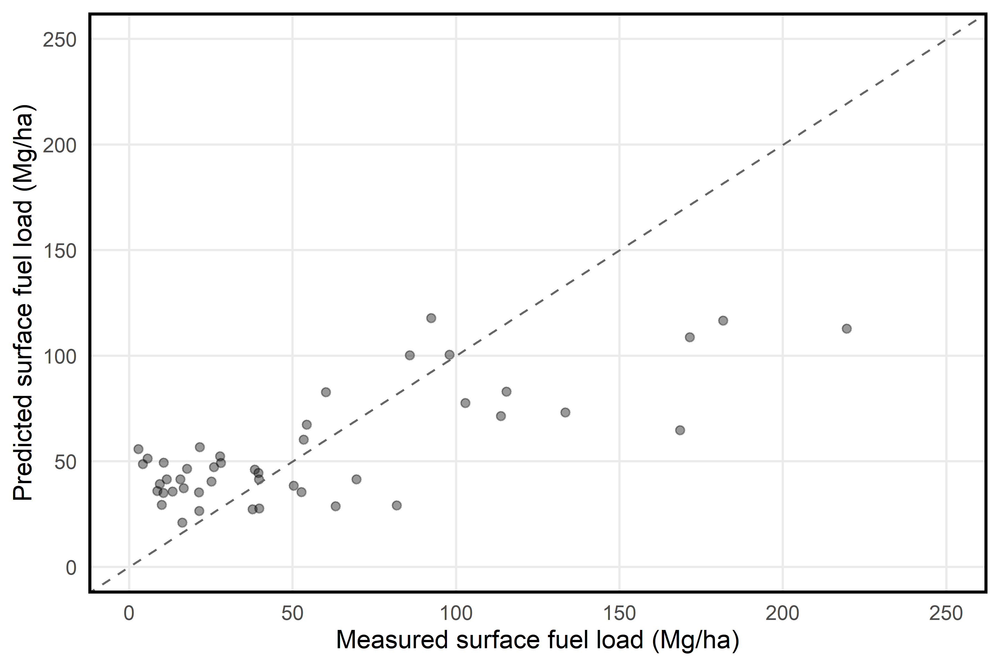
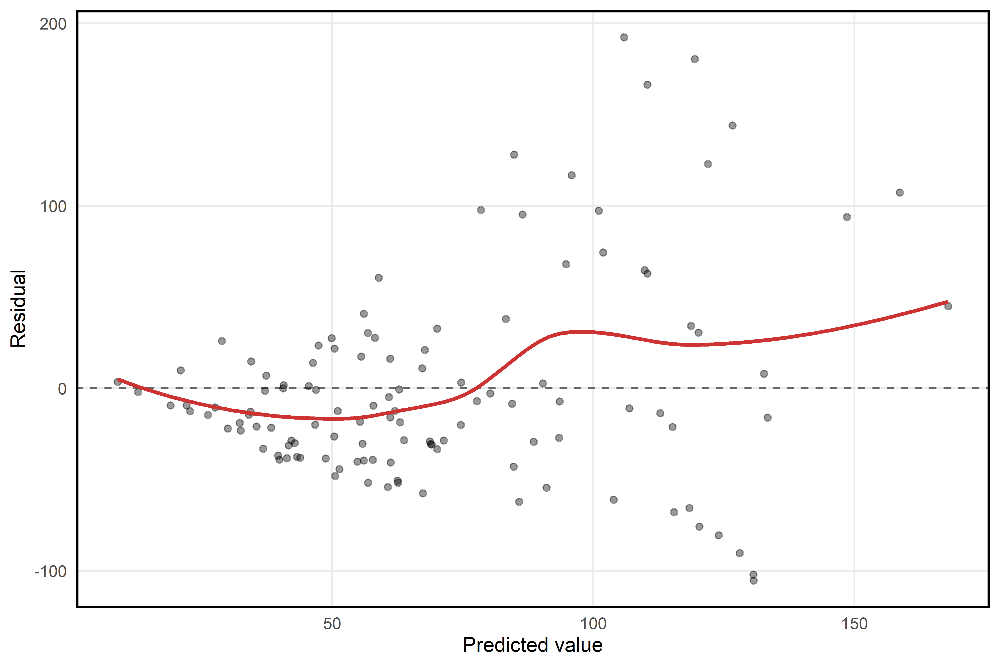
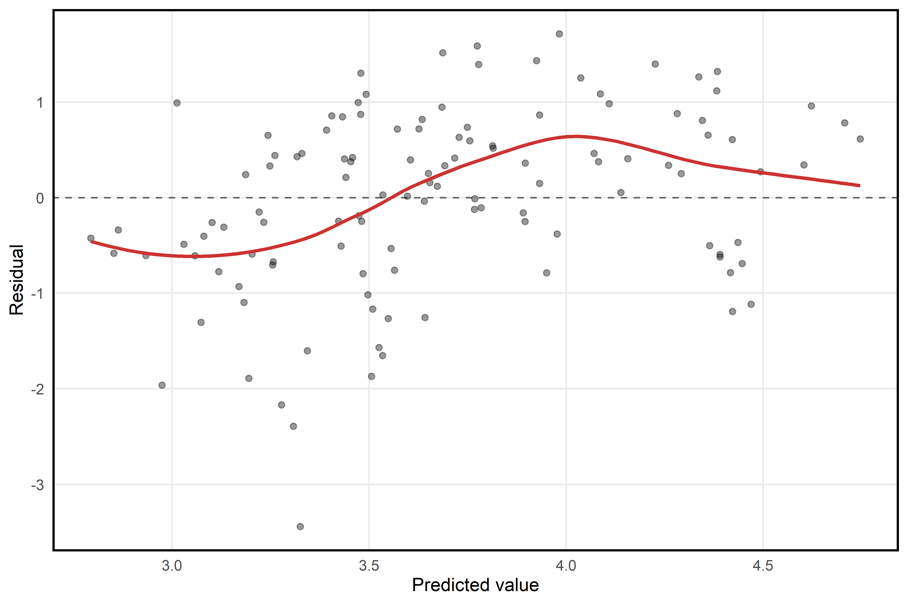
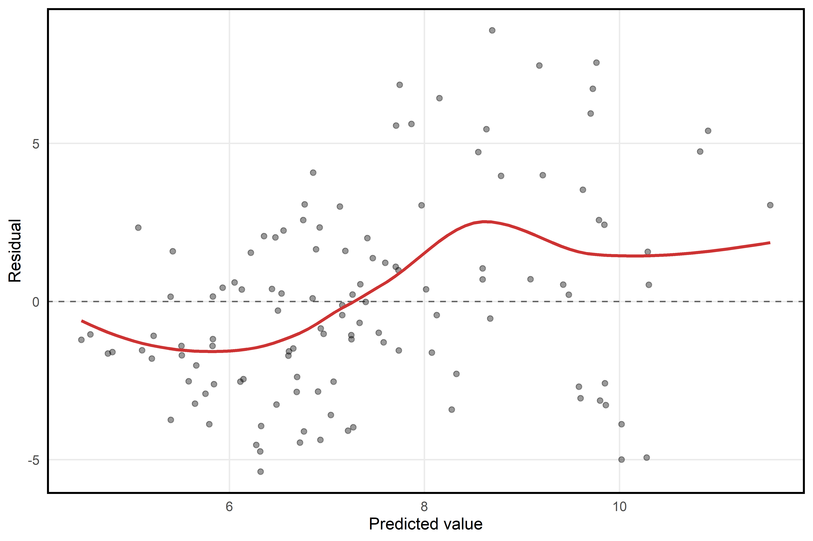
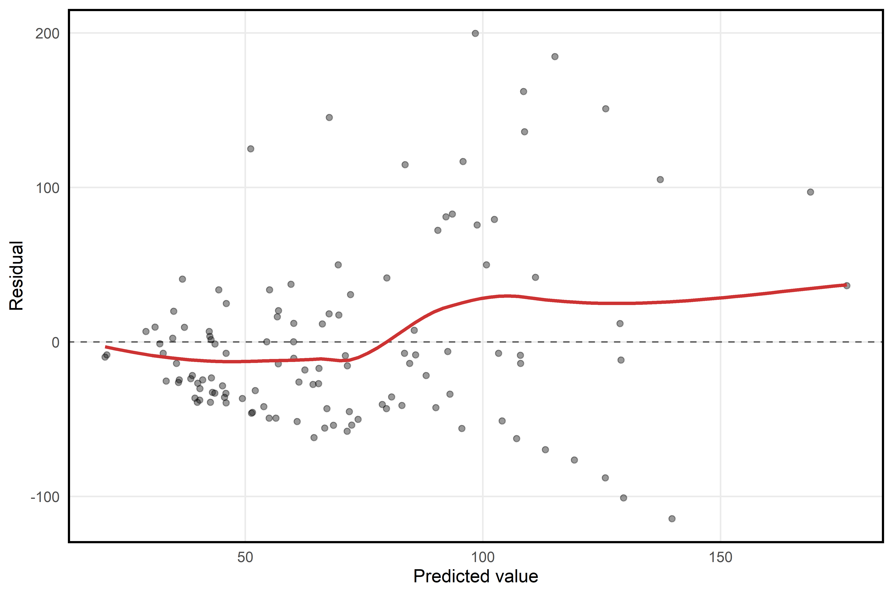
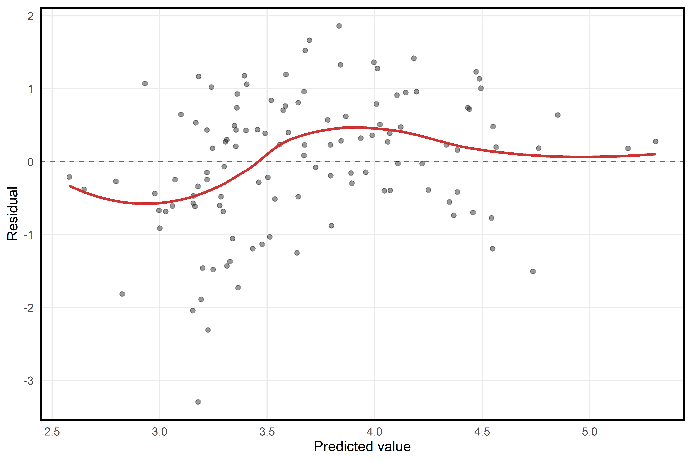
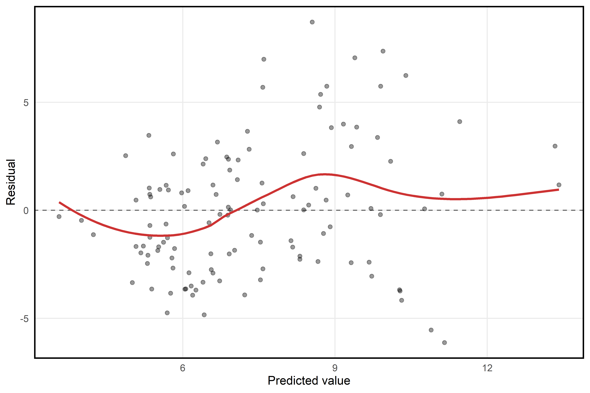

```{r, include=FALSE}
library(tinytex)
#library(latex2exp)
```

## Introduction 

Surface fuels (dead woody material on the forest floor, including fallen twigs, branches, and logs) are a critical forest feature to measure and monitor because they are a primary driver of wildfire behavior. Forest managers use estimates of surface fuels load (weight of surface fuels per unit area) to model potential wildfire behavior, estimate smoke production from prescribed burns, and plan fuel reduction treatments to mitigate wildfire risk. Surface fuels are highly variable across time and space and, therefore, must be measured frequently at a high sampling intensity. However, doing so is extremely labor-intensive using current standard field-based methods.

A promising alternative is to predict surface fuel load using terrestrial LiDAR scans. Terrestrial LiDAR is a ground-based remote sensing technology that generates detailed 3D point clouds (see Appendix for figures of the 3D point clouds). A single scan takes only about five minutes in the field, making it substantially faster than traditional methods. Our goal for this project is to develop a predictive model for surface fuel load using metrics derived from terrestrial LiDAR scans. 

## Data description 

A total of 164 plots were measured across six sites in the Sierra Nevada mixed-conifer forest zone (Table 1). The plots from site BGL were measured and provided by Kea Rutherford, while the data from the remaining sites were provided by collaborators at UC San Diego. 

\begin{table}[h!]
\centering
\begin{tabular}{lc}
\hline
site & number of plots \\
\hline
BGL & 25 \\
DLB & 26 \\
IND & 21 \\
SHA & 25 \\
TCU & 42 \\
WIN & 25 \\
all sites & 164 \\
\hline
\end{tabular}
\caption{Number of observations across sites.}
\end{table}

At each plot, a terrestrial LiDAR scan was taken at plot center. All scans were uploaded to and processed by IntELiMon (Interagency Ecosystem LiDAR Monitoring program maintained by the US Geological Survey's Earth Resources Observation and Science Center). The output from IntELiMon is a large set of plot-level summary metrics derived from the LiDAR scans. Example metrics include: (1) fine_l1_cnt (count of points in the 0-3 meter high voxelized point clouds with tree stems and shrubs removed), (2) TBA (total basal area of all detected overstory trees calculated from classified stem points in the point cloud), and (3) shrubs_l1_cnt (count of points in the Shrub classified voxelized point cloud). surface fuels were also directly measured at each plot using line-intercept transects (the current standard field-based method; Brown 1974). 

For this project, the response variable was total surface fuel load in megagrams per hectare (Mg/ha) calculated from the line-intercept transect data. The response variable is continuous, ranging from 0.89 to 299.85. The predictor variables consisted of site (a factor variable with six levels) and 74 summary metrics derived by IntELiMON from the terrestrial LiDAR scans (all of which are numeric). 

## Final regression model 

Our final model was a LASSO (Least Absolute Shrinkage and Selection Operator) regression. LASSO was appropriate because it performs variable selection by shrinking some coefficients exactly to zero, which is useful when many predictors may be irrelevant, as was the case here. Specifically, we fit a group LASSO, which selects or removes entire groups of variables rather than individual predictors. This ensured that site, a six-level factor variable represented via five dummy variables, was selected or removed as a group. None of the numeric LiDAR variables were explicitly grouped together. A square root transformation of the response variable was necessary to meet the Gauss-Markov model assumption of error terms with mean 0 and variance $\sigma^2$ (residual plots for all models, including the final model, are provided in the additional work section).

Prior to model fitting, the dataset was split into training (75%) and test (25%) sets, with proportional representation of all six forest sites in both sets. The tuning parameter $\lambda$ was selected based on the value that minimized the mean squared error using 10-fold cross-validation on the training set. Out of the models that met assumptions, the final model was selected because it performed best in terms of root mean squared error (RMSE) and $R^2$ evaluated on the held-out test set.

For the final model, RMSE was 36.9 Mg/ha and $R^2$ was 0.51, indicating a moderately good model fit. The fitted line plot (also produced from the held-out test set) demonstrates the moderately good model fit, but also shows some underprediction of large values (Fig. 1). There were 11 selected (i.e., non-zero) coefficients in the final model, including site, the count of points in the 0-3 m high voxelized point clouds with tree stems and shrubs removed, five summary metrics on the entire voxelized point cloud, and four summary metrics on points classified as shrubs. 

```{r fig:myimage1, echo=FALSE, fig.cap="Fitted line plot for held-out test set", out.width="75%", fig.align="center"}

```

## Discussion

Forest managers most commonly use estimates of surface fuel load to (1) model potential wildfire behavior and (2) estimate smoke production (and carbon loss) from prescribed burns. These two applications require different levels of accuracy in surface fuel load estimation. 

Fire behavior models typically rely on a standardized set of 53 discrete surface fuel models (Scott and Burgan 2005). Each model represents a pre-parameterized combination of fuel bed characteristics that influence fire behavior, including fuel load, surface-area-to-volume ratio, packing ratio, and extinction moisture content. Because it is operationally impractical to measure all of these characteristics in the field, managers generally use broad fuel type (e.g., timber litter or slash) along with surface fuel load to select the most appropriate fuel model. As a result, surface fuel load estimates do not need to be highly accurate to be useful in this context—the primary goal is to assign a plot to a reasonable discrete fuel model. From this perspective, our predictive model may be sufficiently accurate to guide managers toward an appropriate fuel model.

In contrast, smoke production models use surface fuel load as a direct quantitative input. Consequently, these models require more accurate estimates of fuel load. In this context, the predictive performance of our model is likely insufficient to support reliable smoke production estimates.

*STILL NEED TO WRITE/INCLUDE LIMITATIONS:*

* hard for TLS to pick up on surface fuels (which are small and on the ground)

* could improve with really intentional metrics aimed at the surface (e.g., surface rugosity)

## Conclusion 

Forest managers are responding to the ongoing wildfire crisis across western North America by assessing wildfire risk and implementing fuel reduction treatments at increasingly large scales. As a result, the ability to efficiently estimate surface fuel loads across large spatial scales is more important than ever. Our results highlight the promising potential of predicting surface fuel load using metrics derived from terrestrial LiDAR scans via the IntELiMon workflow, particularly in the context of fire behavior modeling, where the primary objective is to assign a reasonable discrete fuel model.

\newpage

## Additional work 

We fit both LASSO and ridge regression models. Since this was a predictive problem in which all the predictors are readily available to managers using terrestrial LiDAR scans processed by IntELiMon, a sparse solution was not required; thus, ridge regression was also an appropriate option. For both LASSO and ridge, we assessed model assumptions under three different transformation (none, log, and square root) of the response variable. We visually inspected the residual plots to (1) assess whether the linear models were appropriate (i.e., no curvilinear trends of the average residuals) and (2) check for constant variance across the fitted values. The LASSO model with a square root transformation of the response variable had the best residual plot, the lowest RMSE, and the highest $R^2$, making is the best model choice. 

\begin{table}[h!]
\centering
\begin{tabular}{lccc}
\hline
model type & response transformation & RMSE (Mg/ha) & $R^2$ \\
\hline
ridge & none & 38.7 & 0.46 \\
ridge & log & 40.8 & 0.40 \\
ridge & sqrt & 38.2 & 0.48 \\
lasso & none & 39.1 & 0.45 \\
lasso & log & 39.7 & 0.44 \\
lasso & sqrt & 37.1 & 0.51 \\
\hline
\end{tabular}
\caption{Fit statistics of all models.}
\end{table}

```{r fig:myimage2, echo=FALSE, fig.cap="Residual plot for ridge regression with no transformation of the response variable", out.width="75%", fig.align="center"}

```

```{r fig:myimage3, echo=FALSE, fig.cap="Residual plot for ridge regression with a log transformation of the response variable", out.width="75%", fig.align="center"}

```

```{r fig:myimage4, echo=FALSE, fig.cap="Residual plot for ridge regression with a square root transformation of the response variable", out.width="75%", fig.align="center"}

```

```{r fig:myimage5, echo=FALSE, fig.cap="Residual plot for LASSO regression with no transformation of the response variable", out.width="75%", fig.align="center"}

```

```{r fig:myimage6, echo=FALSE, fig.cap="Residual plot for LASSO regression with a log transformation of the response variable", out.width="75%", fig.align="center"}

```

```{r fig:myimage7, echo=FALSE, fig.cap="Residual plot for LASSO regression with a square root transformation of the response variable", out.width="75%", fig.align="center"}

```

\newpage

## References 

Scott, J.H., and R.E. Burgan (2005). *Standard fire behavior fuel models: A comprehensive set for use with Rothermel's Surface Fire Spread model.* General Technical Report 153. USDA Forest Service, Rocky Mountain Research Station, Fort Collins, CO.

Brown, J.K. (1974). *Handbook for inventorying downed woody material.* General Technical Report INT-16. USDA Forest Service, Intermountain Forest and Range Experiment Station, Ogden, UT.

## Statement of contribution 

\newpage

## Appendix

```{r fig:myimage8, echo=FALSE, fig.cap="Terrestrial LiDAR point cloud, entire plot", out.width="75%", fig.align="center"}
knitr::include_graphics("report_figs/tls_scan_1.png")
```

```{r fig:myimage9, echo=FALSE, fig.cap="Terrestrial LiDAR point cloud, zoomed in", out.width="75%", fig.align="center"}
knitr::include_graphics("report_figs/tls_scan_2.png")
```
