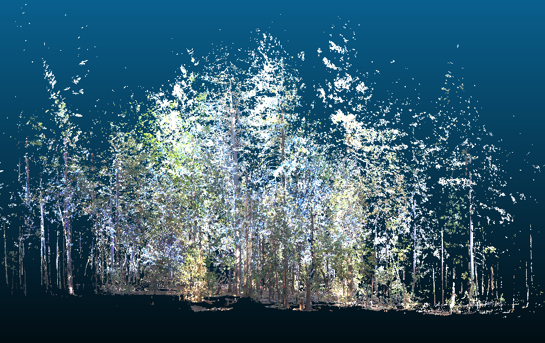
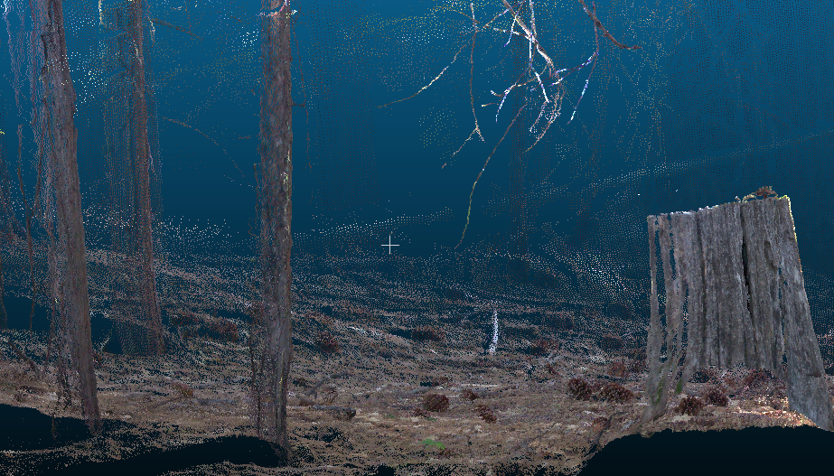

## Introduction 

Surface fuels (dead woody material on the forest floor, including fallen twigs, branches, and logs) are a critical forest feature to measure and monitor because they are a primary driver of wildfire behavior. Forest managers use estimates of surface fuels load (weight of surface fuels per unit area) to model potential wildfire behavior, estimate smoke production from prescribed burns, and plan fuel reduction treatments to mitigate wildfire risk. Surface fuels are highly variable across time and space and, therefore, must be measured frequently at a high sampling intensity. However, doing so is extremely labor-intensive using current standard field-based methods.

A promising alternative is to predict surface fuel load using terrestrial LiDAR scans. Terrestrial LiDAR is a ground-based remote sensing technology that generates detailed 3D point clouds (see Figs. 1 and 2 in the Appendix). A single scan takes only about five minutes in the field, making it substantially faster than traditional methods. Our goal for this project is to develop a predictive model for surface fuel load using metrics derived from terrestrial LiDAR scans. 

## Data description 

A total of 164 plots were measured across six sites in the Sierra Nevada mixed-conifer forest zone (Table 1). The plots from site BGL were measured and provided by Kea Rutherford, while the data from the remaining sites were provided by collaborators at UC San Diego. 

\begin{table}[h!]
\centering
\begin{tabular}{lcc}
\hline
site & number of plots \\
\hline
BGL & 25 \\
DLB & 26 \\
IND & 21 \\
SHA & 25 \\
TCU & 42 \\
WIN & 25 \\
all sites & 164 \\
\hline
\end{tabular}
\caption{Number of observations across sites.}
\end{table}

At each plot, a terrestrial LiDAR scan was taken at plot center. All scans were uploaded to and processed by IntELiMon (Interagency Ecosystem LiDAR Monitoring program maintained by the US Geological Survey's Earth Resources Observation and Science Center). The output from IntELiMon is a large set of plot-level summary metrics derived from the LiDAR scans. Example metrics include: (1) fine_l1_cnt (count of points in the 0-3 meter high voxelized point clouds with tree stems and shrubs removed), (2) TBA (total basal area of all detected overstory trees calculated from classified stem points in the point cloud), and (3) shrubs_l1_cnt (count of points in the Shrub classified voxelized point cloud). surface fuels were also directly measured at each plot using line-intercept transects (the current standard field-based method; Brown 1974). 

For this project, the response variable was total surface fuel load in megagrams per hectare (Mg/ha) calculated from the line-intercept transect data. The response variable is continuous, ranging from 0.89 to 299.85. The predictor variables consisted of site (a factor variable with six levels) and 74 summary metrics derived by IntELiMON from the terrestrial LiDAR scans (all of which are numeric). 

## Final regression model 

Our final model was a LASSO (Least Absolute Shrinkage and Selection Operator) regression with a square root transformation of the response variable. LASSO was appropriate because it performs variable selection by shrinking some coefficients exactly to zero, which is useful when many predictors may be irrelevant, as was the case here. A transformation of the response variable was necessary to meet the Gauss-Markov model assumption of uncorrelated error terms with mean 0 and variance $\sigma^2$ (residual plots for all models, including the final model, are provided in the additional work section).  

Prior to model fitting, the dataset was split into training (74%) and test (25%) sets, with proportional representation of all six forest sites in both sets. The tuning parameter $\lambda$ was selected based on the value that minimized the mean squared error using 10-fold cross-validation on the training set. Out of the models that met assumptions, the final model was selected because it performed best in terms of root mean squared error (RMSE) and $R^2$ evaluated on the held-out test set.

For the final model, RMSE was 36.9 Mg/ha and $R^2$ was 0.51, indicating a moderate model fit. 

* also include the none zero selected variables in the final lasso. And the final fitted line plot (on the test set). 
* include how we dealt with grouping site 


## Discussion

## Conclusion 

## Additional work 

We will fit both a LASSO (Least Absolute Shrinkage and Selection Operator) and a ridge regression model. However, since this is a predictive problem in which all the predictors are readily available, a sparse solution is not required; thus, ridge regression is also an appropriate option.

Residual plots will be used to assess whether the linear models are appropriate (i.e., no systematic or curvilinear trends) and to check for homoskedasticity (i.e., constant variance across the fitted values). Q-Q plots will be used to assess whether the residuals approximately follow a normal distribution. If there is evidence of heteroskedasticity, we will consider transforming the response variable.

\newpage

## References 

Brown, J.K. (1974). *Handbook for inventorying downed woody material.* General Technical Report INT-16. USDA Forest Service, Intermountain Forest and Range Experiment Station, Ogden, UT. https://research.fs.usda.gov/treesearch/28647

\newpage

## Appendix

```{r fig:myimage1, echo=FALSE, fig.cap="Terrestrial LiDAR point cloud, entire plot", out.width="75%", fig.align="center"}

```

```{r fig:myimage2, echo=FALSE, fig.cap="Terrestrial LiDAR point cloud, zoomed in", out.width="75%", fig.align="center"}

```
